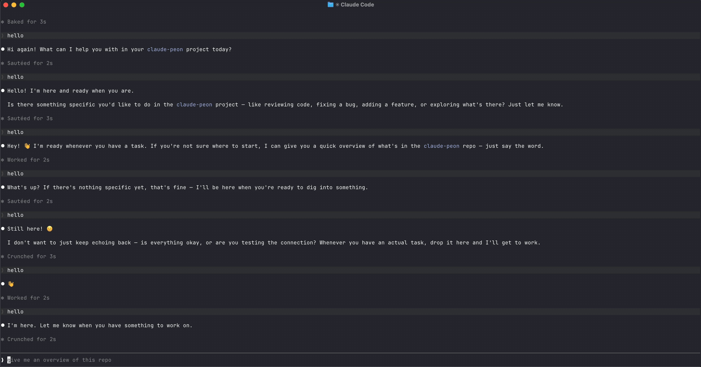

# claude-peon 🪓

Native macOS notifications for [Claude Code](https://www.anthropic.com/claude-code) hooks,
with a **custom icon** and a **voice line** — Warcraft III peon style, in several languages.

- **Task finished** (`Stop` hook) → banner **“Ready to work!”** + the peon's ready voice
- **Waiting for permission / input** (`Notification` hook) → banner + voice, picked at random
  from four lines (**“Yes?” / “Hmm?” / “What you want?” / “Something need doing?”**)

<p align="center">
  
</p>

Built with **only the tools that ship with macOS** — no `terminal-notifier`, no Python, no jq.
The notification icon is the peon because the notification is posted by a tiny `.app`
bundle whose icon is your image. That’s the *real* native way macOS shows a custom icon.

## Install

### Clone + one command (recommended)
```bash
git clone https://github.com/dglazkoff/claude-peon-notifier.git
cd claude-peon-notifier
./install.sh                 # English by default
# ./install.sh --lang ru     # or pick a language: en ru de es fr
```

### curl one-liner
```bash
bash <(curl -fsSL https://raw.githubusercontent.com/dglazkoff/claude-peon-notifier/main/install.sh)
```
> ⚠️ `curl | bash` runs `install.sh` straight from the latest `main` without you seeing it
> first, and it edits `~/.claude/settings.json`. If you'd rather read the script before
> running it, use the clone path.

> The installer copies the scripts **and the `claude-peon` CLI** to `~/.claude/peon`,
> links `claude-peon` onto your PATH, builds `Peon.app`, and merges the `Stop` /
> `Notification` hooks into `~/.claude/settings.json` (idempotent — safe to re-run).

## One manual step (macOS requirement)

macOS won’t show banners until you allow them for the app:

**System Settings → Notifications → Peon → Allow Notifications, style Banners or Alerts.**

The installer opens this pane for you. Then verify:
```bash
claude-peon test
```

## Languages

Voice packs ship for **en · ru · de · es · fr** (English is the default). Each pack
provides the "ready" line plus four random "waiting" lines, and the banner text always
matches the voice. Switch anytime:
```bash
claude-peon lang          # show current + available
claude-peon lang ru       # switch voice + phrases
```

To override the wording without changing the pack, set any of these in
`~/.claude/peon/config.sh` (they win over the pack):
```bash
MSG_DONE="Ready to work!"
MSG_WAIT_1="Yes?"
MSG_WAIT_2="Hmm?"
MSG_WAIT_3="What you want?"
MSG_WAIT_4="Something need doing?"
```

## Change the icon

The notification icon is `~/.claude/peon/peon.jpg` (or `.png`). Replace it and rebuild:
```bash
claude-peon build         # sound/phrases need no rebuild, only the icon does
```

## Silence specific events

The `Notification` hook fires both for permission requests **and** for Claude Code's
idle nudge ("waiting for your input"), which is redundant with the task-finished banner.
Skip events whose `notification_type` / `message` matches a regex via `NOTIFY_EXCLUDE`
in `config.sh`:
```bash
NOTIFY_EXCLUDE="idle_prompt"   # silence the idle nudge, keep permission prompts
```
Only the event's identifying fields (`notification_type` / `message`) are matched — not the
whole payload — so a reply that merely mentions the keyword won't suppress the task-finished
banner. Add more types with `|`, e.g. `NOTIFY_EXCLUDE="idle_prompt|some_other_type"`. Empty
= notify on everything.

## Commands
```
claude-peon install [--lang <code>]   Install (default en), build app, wire hooks, link to PATH
claude-peon lang [<code>]             Show / switch voice language (en ru de es fr)
claude-peon build                     Rebuild Peon.app from the current image
claude-peon test                      Fire both notifications
claude-peon status                    Show what's installed
claude-peon pause                     Stop notifications (remove hooks), keep everything installed
claude-peon resume                    Re-enable notifications after a pause
claude-peon uninstall                 Remove hooks and ~/.claude/peon
```

## How it works

1. A Claude Code hook (`Stop` / `Notification`) runs `notify.sh done|wait`.
2. `notify.sh` writes the phrase to `~/.claude/peon/.msg`, plays the matching sound with
   `afplay`, and `open`s `Peon.app`.
3. `Peon.app` (an AppleScript applet built by `build-app.sh`) reads `.msg` and posts a
   native notification. Because it’s its own bundle with your icon, macOS shows the peon.

## Gotchas this project handles for you

- **No bundle id = silent failure.** `osacompile` applets ship without `CFBundleIdentifier`;
  without one macOS drops every notification. The build adds one, re-signs (`codesign`), and
  re-registers with Launch Services (`lsregister`).
- **Banners default to off.** macOS delivers to Notification Center but shows no banner until
  you enable it (the one manual step above).
- **`iconutil` is flaky.** It fails with *“Failed to generate ICNS”* on some JPEGs, so the icon
  is built via `sips` direct conversion instead.
- **Icon caching.** The build re-registers the app with Launch Services so the new icon
  is picked up. If a changed icon still looks stale in notifications, log out/in once —
  the build deliberately does **not** kill `usernoted`, since doing that mid-run breaks
  notification delivery until the daemon is restarted.

## Had enough notifications?

You don't have to uninstall. Pick whichever fits:

- **Turn the peon off but keep it installed** — removes the hooks, leaves the app/assets:
  ```bash
  claude-peon pause      # re-enable later with: claude-peon resume
  ```
- **Just silence the banners** — leave everything wired and toggle it in macOS:
  **System Settings → Notifications → Peon → Allow Notifications off.**
  No need to delete the app; flip it back on anytime.

## Uninstall
```bash
claude-peon uninstall      # removes hooks, ~/.claude/peon, and the PATH symlink
```

## Credits & License

Code: MIT.

Voice packs come from [PeonPing / og-packs](https://github.com/PeonPing/og-packs) (CESP
sound packs) and are licensed **CC-BY-NC-4.0** (non-commercial, attribution required). See
each pack's upstream `openpeon.json` for author/metadata. If you redistribute this project
commercially, swap in your own audio.
